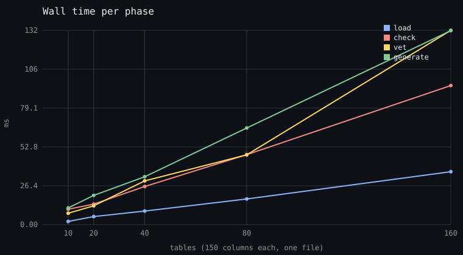
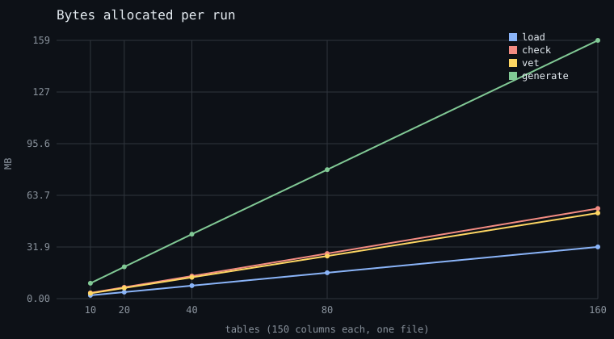
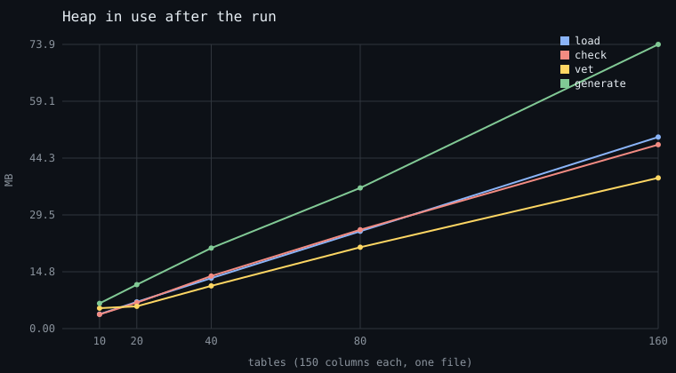
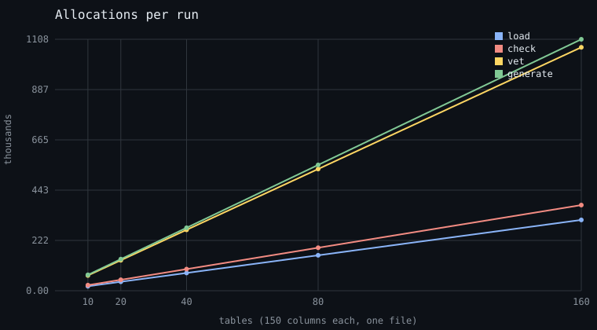

# Profiling sweep, 2026-09-14: one file, 10 to 160 tables

Pinned research (D49: `reference/` is consulted, not maintained). The
numbers are from one machine on one day; the method is repeatable and
lives in the test suite, so a later sweep is compared against this one
by rerunning it, not by trusting it.

**Method.** `lang/profile_sweep_test.go` (`TestProfileSweep`, skipped
unless `VOLT_SWEEP_DIR` is set) writes one-file projects with
`internal/corpus` at 10, 20, 40, 80 and 160 tables of 150 columns, the
stress shape of D80 at smaller sizes, and runs each phase on its own:
Load (scan and parse), Check, Vet, Generate (every file of every
package, DDL included). Per phase and size: the best wall time of three
unprofiled runs, one run's allocated bytes, allocation count and heap in
use right after the run, then enough profiled runs to fill about two
seconds of CPU profile. The charts are drawn by the test.

```sh
VOLT_SWEEP_DIR=/tmp/sweep go test ./lang -run TestProfileSweep -count=1 -timeout 30m -v
```

Machine: 4 CPUs, Intel Xeon 2.80 GHz, go1.27.0, Linux, commit 50effa2
plus the idempotence fix below. Nothing else was running.

## Charts









## Numbers

Wall time, best of three, in milliseconds:

| Tables | Source | Load | Check | Vet | Generate | Output |
|---|---|---|---|---|---|---|
| 10 | 160 KB | 2.2 | 10.5 | 7.8 | 11.3 | 0.7 MB |
| 20 | 320 KB | 5.5 | 13.9 | 12.8 | 19.9 | 1.4 MB |
| 40 | 640 KB | 9.2 | 25.9 | 29.7 | 32.5 | 2.9 MB |
| 80 | 1.3 MB | 17.4 | 47.5 | 47.4 | 65.6 | 5.8 MB |
| 160 | 2.6 MB | 35.9 | 94.4 | 131.9 | 131.7 | 11.6 MB |
| growth 160/10 | 16× | 16.3× | 9.0× | 16.9× | 11.7× | 16× |

Bytes allocated by one run, in MB, and allocations in thousands:

| Tables | Load | Check | Vet | Generate |
|---|---|---|---|---|
| 10 | 2.0 / 20 | 3.6 / 24 | 3.3 / 67 | 9.5 / 70 |
| 20 | 4.0 / 39 | 7.0 / 48 | 6.6 / 134 | 19.6 / 139 |
| 40 | 8.0 / 78 | 14.0 / 95 | 13.2 / 268 | 39.8 / 278 |
| 80 | 16.0 / 156 | 27.9 / 189 | 26.3 / 537 | 79.6 / 554 |
| 160 | 31.9 / 312 | 55.6 / 378 | 52.9 / 1073 | 159.4 / 1108 |

Per table at 160, the steady-state cost: Load 0.22 ms and 200 KB, Check
0.59 ms and 350 KB, Vet 0.82 ms and 330 KB but 6,700 allocations,
Generate 0.82 ms and 1 MB allocated for 72 KB of output.

## Reading

**Every phase is linear in tables.** Doubling the input doubles each
phase within noise, and the 160/10 ratios sit at or under 16, the
input ratio. Check's 9× is a fixed cost showing at 10 tables (the
routing phase's setup and the plan's enum and import work), not
sublinear growth. Heap in use after a run grows linearly too; nothing
is retained across runs.

**The collector takes 15 to 20 percent of every phase.** In each flat
profile the top runtime entries are the mark phase
(`tryDeferToSpanScan`, `scanObjectsSmall`) and span clearing. The
front end's data is pointers: an 88-byte token, an AST node per
allocation, positions carrying a filename string. This is the PERF-9
floor and it is the same in every phase because every phase walks that
data.

**Vet costs more than Check at 160 tables**, and allocates three times
as many objects. Two reasons in its profile: the dyn-name analyzer
rebuilds the naming plan the checker already built (23 percent of
Vet), and the generic AST walker allocates a child slice per node
(`ast.children`, 26 percent, most of the million allocations). Vet runs
only on demand and its warnings are memoized in the editor session, so
this is a cost of `volt vet` on the command line, not of the edit loop.

**Generate allocates 14 bytes for every byte it emits.** Its flat
profile is `memmove` first: builders grow by copying, blocks are
aligned by re-rendering, and every column's Go name, type and tag is
formatted with `fmt`. The output is byte-compared before it is
written, so a no-op regeneration pays this once and writes nothing.

## Per function

Cumulative share of the phase's CPU at 160 tables, this package's own
functions, top entries. A caller and its callee both appear when the
callee is the whole of the caller.

### Load

| Function | Share | What it is |
|---|---|---|
| `parser.ParseFile` | 64% | the parse, tokens to AST |
| `parser.(*parser).column` | 31% | one column: name, type, settings |
| `scanner.Scan` | 27% | the scan, bytes to tokens |
| `parser.(*parser).settingList` | 16% | `[pk, not null, note: '...']` |
| `parser.(*parser).typeRef` | 11% | the column type |
| `parser.(*parser).ident` + `qualName` | 18% | identifier nodes, one allocation each |

Flat: the collector, then `expect`, `tokEmit`, `next`. A column of the
corpus is about six tokens and four allocations.

### Check

| Function | Share | What it is |
|---|---|---|
| `golang.tableBuild` / `fieldBuild` | 27% | the naming plan: Go names, types, tags per column, on the worker pool |
| `check.File` | 13% | schema semantics: columns expanded through partials, refs, indexes |
| `checker.routing` / `scopeWalk` | 10% | route expansion and conflict trie |
| `checker.resourcesExpand` | 9% | default resources, five routes per table |
| `checker.tableChecks` / `checkEnv` | 8% | typed checks lowered to Go and SQL |
| `checker.dataQueries` | 7% | groups, preds, selects and the select index |
| `Plan.ModelFields` | 6% | field lists asked by the check lowering |
| `checker.queryBind` | 5% | binding a query route: now a map lookup |

Flat: the collector, `ast.(*Ident).Name`, map hashing of strings,
`SettingList.Get`. The plan's share is the cost of computing Go names
with string building per column; it is the first candidate for
interning (PERF-9).

### Vet

| Function | Share | What it is |
|---|---|---|
| `vet.Run` | 47% | every analyzer over the merged file |
| `ast.Inspect` / `ast.children` | 29% | the generic walker, allocating a child slice per node |
| `golang.tableBuild` via `DynNameCollisions` | 23% | the plan built a second time |
| three analyzers | 7% each | the `init.func` entries are analyzer closures |

The other half of Vet's cumulative time is the collector and map work
inside the analyzers.

### Generate

| Function | Share | What it is |
|---|---|---|
| `Plan.Models` / `modelsGenerate` | 26% | structs, params structs, enums |
| `Plan.Queries` | 17% | CRUD methods |
| `Plan.Dyn` | 15% | one typed handle per column |
| `generator.tableEmit` / `fieldEmit` | 24% | one table's struct and fields |
| `align.(*Block).WriteTo` | 11% | column alignment of struct fields and tags |
| `generator.paramsEmit` / `paramFieldsWrite` | 10% | create and update params structs |

Flat: `memmove` 14%, the collector 15%, `concatstrings`,
`SettingList.Get` (asked per field for `pk`, `unique`, `note`, ...).
The models file is the biggest of the outputs (434K of 1.45M lines at
a thousand tables) and the emitters' cost follows the output.

## What the sweep found on its first run

The first run reported Generate at 382 ms and 324 MB for 10 tables,
which no output of 0.7 MB explains. The cause was in the method, and it
was a real bug: `lang.Check` appended routes, selects and check
functions to a package on every call, so a project checked twice
carried everything twice, and the sweep's profiled loop checked
hundreds of times. `Check` is now idempotent: a package's results are
reset before its phases run, proven by `TestCheckIsIdempotent`, which
failed before the fix. No user-facing path checked a project twice,
but the language server's session and any profiler loop could have.

## What to do with this

In order of expected payoff, all filed in `roadmap.md`:

1. PERF-9, the flat front end: tokens as offsets, AST in slabs,
   interned names. It is the collector's 15 to 20 percent in every
   phase plus the plan's string building, so roughly a third of Check
   and Load.
2. Vet: hand the analyzers the checker's plan instead of rebuilding
   it, and give the walker a non-allocating child visit. Halves Vet.
3. Generate: size builders from the plan (bytes per table are
   predictable) and align blocks in place. A fifth of Generate, and
   most of its 14 bytes allocated per byte emitted.
4. PERF-10 for the editor, where the file is the unit and one edit
   should cost one declaration.

## Follow-up the same day: items 2 and 3 landed

Vet now takes the checker's plan (`vet.RunWithPlan`, `Pass.Plan`)
instead of building it again, and the AST walker visits children
through a callback instead of allocating a slice per node. Generate
sizes each emitter's buffer from the plan's column count, grows the
output buffer once before joining, and `align.Finish` collapses blank
lines in one pass over one copy. Same machine, same method, rerun:

| Tables | Vet before | Vet after | Generate before | Generate after |
|---|---|---|---|---|
| 10 | 7.8 ms, 3.3 MB, 67K allocs | 1.9 ms, 0.9 MB, 5K allocs | 11.3 ms, 9.5 MB | 10.9 ms, 7.5 MB |
| 40 | 29.7 ms, 13.2 MB, 268K | 7.7 ms, 3.5 MB, 20K | 32.5 ms, 39.8 MB | 27.2 ms, 29.9 MB |
| 160 | 131.9 ms, 52.9 MB, 1073K | 44.0 ms, 14.1 MB, 81K | 131.7 ms, 159.4 MB | 113.6 ms, 118.8 MB |

Vet is three times faster and allocates thirteen times fewer objects;
it is now cheaper than Check, as an analyzer pass over checked data
should be. Generate allocates a quarter less and runs about fifteen
percent faster; its allocation count did not move, because those are
the per-field `fmt` calls and string concatenations of the emitters,
which is the next lever there. Load and Check are unchanged and the
run-to-run noise on them is about ten percent.

## Follow-up the same day: the front end flattened (D82)

Positions became a file pointer plus 32-bit offsets, tokens went from
88 bytes and three pointers to 48 and two, and the parser slab-allocates
its hottest node kinds. Same machine, same method:

| Tables | Load before | Load after |
|---|---|---|
| 40 | 9.2 ms, 8.0 MB, 78K allocs | 7.7 ms, 5.9 MB, 32K allocs |
| 160 | 35.9 ms, 31.9 MB, 312K allocs | 27.1 ms, 23.2 MB, 126K allocs |

Check, Vet and Generate are within noise of their previous numbers:
their allocations are their own (the naming plan's strings, the
emitters' formatting), not the AST's. Heap in use after Load at 160
tables fell from 49.8 MB to 36.6 MB, which is what the editor holds
per open project.

## Follow-up the same day: the edit loop on the thousand-table file (D83)

The session's parse is by declaration now. On the one-file stress
project (1000 tables, 164K lines), one edit inside one table:

| Step | Before | After |
|---|---|---|
| Parse after the edit | 340 ms, 2008 declarations | 22 ms, 1 declaration parsed, 2007 reused |
| Check after the edit | 700 ms | 650 ms (table checks on every CPU) |

The check is what remains of PERF-10: the package is still checked
whole after an edit, and its cost is spread over the naming plan, the
schema check, route expansion and binding, none of which knows which
declaration moved.

## Follow-up the same day: the check by declaration (D84)

The package check keeps memos across the session's checks, keyed on
node identity: tables, models, lowered checks and selects whose inputs
are the objects they were are answered from the last check. On the
one-file stress project, one edit inside one table:

| Step | Whole | By declaration |
|---|---|---|
| Parse after the edit | 340 ms | 22 ms |
| Check after the edit | 700 ms | 90 to 190 ms |

The spread is the collector: the heap holds the whole project and a
cycle lands in some edits and not others. What runs whole is route
expansion and conflict detection, about 50 ms, and the group select
over every table, which is checked again whenever any table changes.

## Follow-up the same day: the server's index (D85)

With the check by declaration, the language server's own navigation
index was three quarters of an edit: rebuilt whole on every analysis,
with a linear table lookup inside. It is now kept by table across
analyses, sized from the last build, with tables by bare name a map.
The server's whole analysis of one edit on the thousand-table file,
twelve edits:

| | Before | After |
|---|---|---|
| Best | 400 ms | 106 ms |
| Mean | 550 ms | 163 ms |

The session's parse and check are about 100 ms of that; the rest is
the parts of the index that still run whole and the collector, whose
share grows with the memos' retention (heap in use about 500 MB for
this project after a dozen edits).

## Follow-up, 2026-09-19: the sweep rerun after D103 to D105

The same method on the same shapes, the same machine class (4 CPUs,
go1.27.0), commit f3f8278 plus the closing measurements. Wall time,
best of three, in milliseconds, the 2026-09-14 number in parentheses:

| Tables | Load | Check | Vet | Generate |
|---|---|---|---|---|
| 10 | 2.2 (2.2) | 7.2 (10.5) | 2.8 (7.8) | 10.9 (11.3) |
| 20 | 3.6 (5.5) | 11.6 (13.9) | 4.9 (12.8) | 11.7 (19.9) |
| 40 | 7.2 (9.2) | 18.7 (25.9) | 6.2 (29.7) | 24.9 (32.5) |
| 80 | 12.7 (17.4) | 35.3 (47.5) | 9.4 (47.4) | 46.3 (65.6) |
| 160 | 28.3 (35.9) | 72.7 (94.4) | 18.6 (131.9) | 83.7 (131.7) |
| growth 160/10 | 12.9× | 10.1× | 6.6× | 7.7× |

Bytes allocated by one run, in MB, and allocations in thousands:

| Tables | Load | Check | Vet | Generate |
|---|---|---|---|---|
| 10 | 1.1 / 8 | 3.5 / 25 | 1.6 / 13 | 7.1 / 68 |
| 20 | 2.0 / 16 | 6.9 / 48 | 3.2 / 27 | 14.3 / 135 |
| 40 | 3.9 / 32 | 13.7 / 96 | 6.4 / 53 | 28.5 / 270 |
| 80 | 7.5 / 64 | 27.4 / 190 | 12.9 / 106 | 56.7 / 540 |
| 160 | 14.8 / 127 | 54.7 / 379 | 25.7 / 212 | 113.7 / 1080 |

Per table at 160: Load 0.18 ms and 93 KB, Check 0.45 ms and 340 KB,
Vet 0.12 ms and 160 KB with 1,300 allocations, Generate 0.52 ms and
710 KB. What moved since the first sweep: Load's bytes halved and its
allocations fell by 60 percent with the flat front end (D82) and the
chunked parse (D83); Vet is seven times faster cold and allocates
half the bytes with a fifth of the allocations, judged by declaration
on every CPU without a closure per node and without the walk over
every minted name (D104); Generate is a third faster since the
emitters were made canonical by construction and sized from the plan
(D75, D81). The whole sweep, profiled runs included, took 36 s
against about 3 minutes on the first day. The stress project (1000
tables, one file) that day: `volt check` cold 1.8 s wall, `volt gen`
with its outputs already on disk 4.1 s wall; one keystroke through the
server's stdio about 0.22 s (D105), of which the pieces are measured
in D105.
